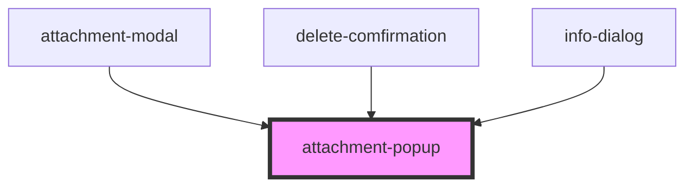

# attachment-popup

<!-- Auto Generated Below -->

## Events

| Event     | Description | Type               |
| --------- | ----------- | ------------------ |
| `onClose` |             | `CustomEvent<any>` |
| `onOpen`  |             | `CustomEvent<any>` |

## Methods

### `close() => Promise<void>`

#### Returns

Type: `Promise<void>`

### `open() => Promise<void>`

#### Returns

Type: `Promise<void>`

## Dependencies

### Used by

 - [attachment-modal](..\Modal)
 - [delete-comfirmation](..\Forms)
 - [info-dialog](..\Forms)

### Graph

----------------------------------------------

*Built with [StencilJS](https://stenciljs.com/)*
