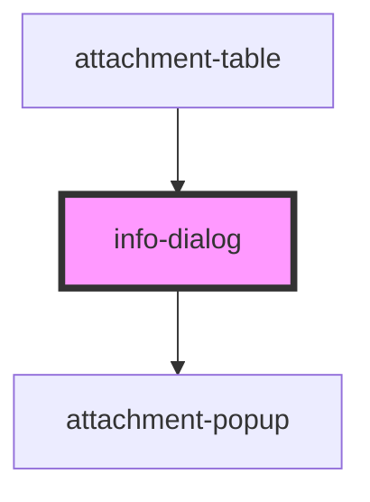

# info-dialog

<!-- Auto Generated Below -->

## Methods

### `close() => Promise<void>`

#### Returns

Type: `Promise<void>`

### `open(attachmentItem: AttachmentItem) => Promise<void>`

#### Returns

Type: `Promise<void>`

## Dependencies

### Used by

 - [attachment-table](..\Table)

### Depends on

- [attachment-popup](..\Popup)

### Graph

----------------------------------------------

*Built with [StencilJS](https://stenciljs.com/)*
