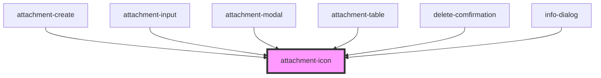

# attachment-icon

<!-- Auto Generated Below -->

## Properties

| Property   | Attribute   | Description | Type     | Default     |
| ---------- | ----------- | ----------- | -------- | ----------- |
| `IconName` | `icon-name` |             | `string` | `undefined` |

## Dependencies

### Used by

 - [attachment-create](..\Forms)
 - [attachment-input](..\Input)
 - [attachment-modal](..\Modal)
 - [attachment-table](..\Table)
 - [delete-comfirmation](..\Forms)
 - [info-dialog](..\Forms)

### Graph

----------------------------------------------

*Built with [StencilJS](https://stenciljs.com/)*
