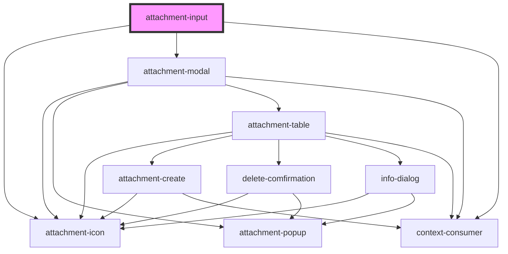

# attachment-input

<!-- Auto Generated Below -->

## Properties

| Property      | Attribute     | Description | Type     | Default     |
| ------------- | ------------- | ----------- | -------- | ----------- |
| `EntityId`    | `entity-id`   |             | `string` | `undefined` |
| `EntityName`  | `entity-name` |             | `string` | `undefined` |
| `FieldName`   | `field-name`  |             | `string` | `undefined` |
| `Placeholder` | `placeholder` |             | `string` | `undefined` |

## Dependencies

### Depends on

- [attachment-icon](..\Icon)
- [attachment-modal](..\Modal)
- context-consumer

### Graph

----------------------------------------------

*Built with [StencilJS](https://stenciljs.com/)*
