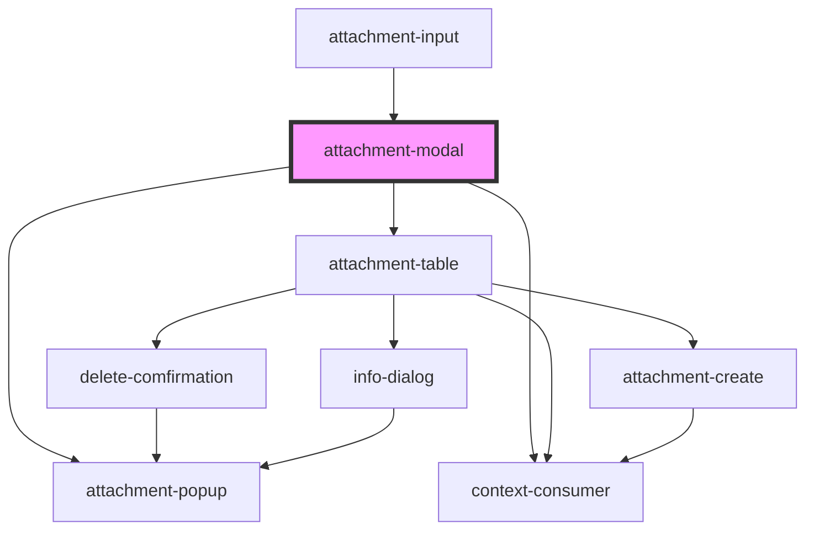

# attachment-modal

<!-- Auto Generated Below -->

## Properties

| Property        | Attribute | Description | Type                 | Default     |
| --------------- | --------- | ----------- | -------------------- | ----------- |
| `AttachmentKey` | --        |             | `AttachmentKeyModel` | `undefined` |

## Methods

### `close() => Promise<void>`

#### Returns

Type: `Promise<void>`

### `open() => Promise<void>`

#### Returns

Type: `Promise<void>`

## Dependencies

### Used by

 - [attachment-input](..\Input)

### Depends on

- [attachment-popup](..\Popup)
- [attachment-table](..\Table)
- context-consumer

### Graph

----------------------------------------------

*Built with [StencilJS](https://stenciljs.com/)*
