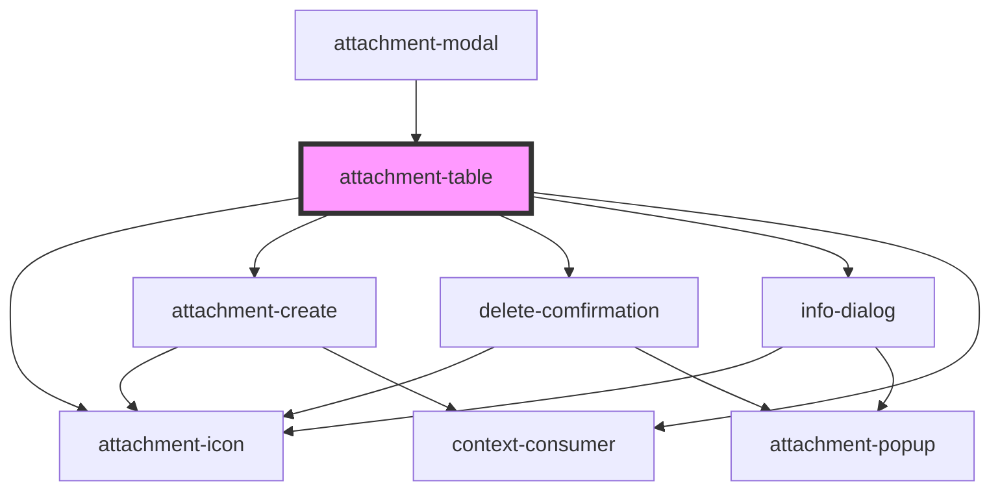

# attachment-table

<!-- Auto Generated Below -->

## Properties

| Property        | Attribute | Description | Type                 | Default     |
| --------------- | --------- | ----------- | -------------------- | ----------- |
| `AttachmentKey` | --        |             | `AttachmentKeyModel` | `undefined` |

## Events

| Event            | Description | Type               |
| ---------------- | ----------- | ------------------ |
| `onEndLoading`   |             | `CustomEvent<any>` |
| `onStartLoading` |             | `CustomEvent<any>` |

## Methods

### `Load(pageIndex: number, pageSize: number) => Promise<AttachmentItemPagedList>`

#### Returns

Type: `Promise<AttachmentItemPagedList>`

### `Refresh() => Promise<AttachmentItemPagedList>`

#### Returns

Type: `Promise<AttachmentItemPagedList>`

## Dependencies

### Used by

 - [attachment-modal](..\Modal)

### Depends on

- [attachment-icon](..\Icon)
- [attachment-create](..\Forms)
- [delete-comfirmation](..\Forms)
- [info-dialog](..\Forms)
- context-consumer

### Graph

----------------------------------------------

*Built with [StencilJS](https://stenciljs.com/)*
